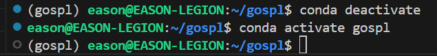

# WIN10 WSL2 Ubuntu 24.04.2 LTS 安装命令:

## 下载 Miniforge 安装脚本
```
wget https://github.com/conda-forge/miniforge/releases/latest/download/Miniforge3-Linux-x86_64.sh

bash Miniforge3-Linux-x86_64.sh

conda config --set auto_activate_base false
```


## 下载gospl 源码
```
git clone https://github.com/EELIC/gospl.git
```

安装修改记录 因为 numpy version numpy=1.23.5
environment.yml 修改内容

```
dependencies:
- numpy=1.23.5 
- pip:
    - git+https://github.com/EELIC/gospl.git
```

pyproject.toml 修改内容

```
dependencies = [
    "numpy==1.23.5",
]
```


## 列出虚拟环境
```
conda env list
```

## 进入目录执行gospl1环境安装
```
cd ~/gospl

conda env create -n gospl -f environment.yml 
```
## 安装 jupyter
```
conda install jupyter

```

## 安装失败->删除已安装gospl环境
```
cd ~
conda remove -n gospl --all
```
修改 environment.yml

重复上述安装过程

## 运行 goSPL-examples
```
conda activate gospl
```

## 安装中文语言包
```
pip install jupyterlab-language-pack-zh-CN
```
## jupyter查看和清理现有内核
```
# 查看现有内核
jupyter kernelspec list
# 删除多余内核	
jupyter kernelspec remove gospl1
操作	命令或操作

# 注册 gospl 为 Jupyter 内核	

conda activate gospl
which python
python -m ipykernel install --user --name gospl --display-name "Python (gospl)"
```

## jupyter查看版本
```
jupyter --version
```
回应输出:
```
Selected Jupyter core packages...
IPython          : 9.3.0
ipykernel        : 6.29.5
ipywidgets       : 8.1.7
jupyter_client   : 8.6.3
jupyter_core     : 5.8.1
jupyter_server   : 2.16.0
jupyterlab       : 4.4.3
nbclient         : 0.10.2
nbconvert        : 7.16.6
nbformat         : 5.10.4
notebook         : 7.4.3
qtconsole        : not installed
traitlets        : 5.14.3
```


## 在 Jupyter Notebook 中验证解释器路径
在笔记本第一个单元格中运行：
```
python
 
import sys
print(sys.executable)
# 你应该看到这个路径：


/home/eason/miniforge3/envs/gospl/bin/python
```


## 确认 numpy 的版本

```
python -c "import numpy; print('NumPy:', numpy.__version__); print('numpy OK')"
```

## 在当前文件夹启动 Jupyter Notebook
```
cd ~/goSPL-examples/Local-examples/stratigraphic_record
jupyter notebook

```
## 浏览器打开
复制类似链接
```
http://localhost:8888/tree?token=504197a5aa32aca8b78794e66f6d8c2c1d1fdea8dad8d559
```

## 还有错误处理
 降级 numpy 到 1.23.x 或 1.24.x 的版本
```
conda install numpy=1.23.5
```

## 示例运行 
清理旧的 Python 缓存（重要）
```
find . -name "*.pyc" -delete
find . -name "__pycache__" -type d -exec rm -r {} +
```
# gospl使用指南
https://gospl.readthedocs.io/en/stable/index.html 

## goSPL（缩写）是一个开源的、GPL 许可库，
提供可扩展的基于 Python 的并行数值模型，以模拟全球范围内的景观和盆地重建。goSPL 由悉尼大学的EarthCodeLab 小组开发。Global Scalable Paleo Landscape Evolution 

## 需求声明

自20世纪90年代以来，许多软件被设计用于估算长期流域动态、水系演化以及沉积盆地在各种机制（例如构造或气候强迫）下的形成。这些模型依赖于一套数学和物理表达式，用于模拟泥沙的侵蚀、输送和沉积，并能够再现地球表面地貌演化的一阶复杂性。

然而，我们仍然缺少一个工具来评估全球尺度的地球表面演化及其与大气、水圈、构造和地幔动力学的相互作用。goSPL 是第一个旨在填补这一空白的模型。它可以用来更好地描述地球系统的诸多方面，从大气环流对物理剥蚀的作用，从侵蚀和沉积物沉积对地幔对流的影响，从自然资源的分布和丰度，到生命的演化。

## 引用
出于礼貌，我们要求使用此代码的人引用我们在 JOSS 上发表的初始论文。

Salles 等人 (2020)《gospl：全球可扩展古景观演化》，《开源软件杂志》，5(56)，第 2804 页。doi: 10.21105/joss.02804。

BibTeX：

@article{salles2020,
    author={Salles, Tristan and Mallard, Claire and Zahirovic, Sabin},
    title={gospl: Global Scalable Paleo Landscape Evolution},
    journal={Journal of Open Source Software},
    year={2020},
    volume={5},
    number={56},
    pages={2804},
    DOI={10.21105/joss.02804}
}

## 通过源代码安装
以下是从 git 源代码树构建 goSPL 的一些主要说明。此方法主要适用于在 Linux 环境中工作的经验丰富的用户。强烈建议使用conda，以便快速安装以及更新软件包和依赖项。
### 更新系统
```
apt-get update -qq
apt-get install -yq --no-install-recommends bash-completion build-essential
apt-get install -yq --no-install-recommends python3-minimal python3-dev python3-pip
apt-get install -yq --no-install-recommends python3-tk python3-dbg cmake
apt-get install -yq --no-install-recommends python3-setuptools wget gfortran
apt-get install -yq --no-install-recommends proj-bin
```
### MPICH 
```
mkdir /tmp/mpich-build
wget http://www.mpich.org/static/downloads/${MPICH_VERSION}/mpich-3.3.tar.gz
tar xvzf mpich-3.3.tar.gz
cd mpich-3.3
./configure --enable-fast=all,O3 --prefix=/opt/mpich
make -j4
make install
ldconfig
cd /tmp
rm -fr *

export MPI_DIR=/opt/mpich
export PATH=/opt/mpich/bin:$PATH
```

### PETSc 
```
mkdir /tmp/petsc-build
wget http://ftp.mcs.anl.gov/pub/petsc/release-snapshots/petsc-lite-3.13.5.tar.gz
tar zxf petsc-lite-3.13.5.tar.gz
cd petsc-3.13.5
./configure --with-debugging=0 --prefix=/opt/petsc
            --COPTFLAGS="-g -O3" --CXXOPTFLAGS="-g -O3" --FOPTFLAGS="-g -O3"
            --with-zlib=1
            --download-fblaslapack=1
            --download-ctetgen=1
            --download-triangle=1
            --download-hdf5=1
            --download-mumps=1
            --download-parmetis=1
            --download-eigen=1
            --download-metis=1
            --download-hypre=1
            --download-scalapack=1
            --download-pragmatic=1
            --useThreads=1
            --with-shared-libraries
            --with-cxx-dialect=C++11
make PETSC_DIR=/tmp/petsc-build/petsc-3.13.5 PETSC_ARCH=arch-linux-c-opt all
make PETSC_DIR=/tmp/petsc-build/petsc-3.13.5 PETSC_ARCH=arch-linux-c-opt install
make PETSC_DIR=/opt/petsc PETSC_ARCH="" check
cd /tmp
rm -fr *
export PETSC_DIR=/opt/petsc
export PATH=/opt/petsc/bin:$PATH
```

### 依赖
goSPL 有许多必需的依赖项。如果某个依赖项未安装，则ImportError在调用需要该依赖项的方法/类时，goSPL 会引发异常。

XXXX通过终端中的以下命令安装依赖项：
```
pip install XXXX
```

### goSPL 安装
安装上面列出的所有依赖项后，即可通过GitHub获取 goSPL 源文件：
```
git clone https://github.com/Geodels/gospl
```

然后可以使用以下命令将其本地安装在您的系统上：
```
pip install --no-build-isolation -e .
```

此外，最新版本的 goSPL 需要isoFlex库，可以从GitHub安装：
```
git clone github.com/Geodels/isoFlex.git
```

然后可以使用以下命令将其本地安装在您的系统上：
```
pip install --no-build-isolation -e .
```

终端测试安装结果
```
pip list | grep isoflex

isoflex            0.0.1
```


## 技术指南
本指南涵盖了用于解决多流向水路由和侵蚀沉积过程主要算法的隐式、迭代方法，这些算法在 goSPL 中实现。

goSPL 主要是Python用 编写的，其中的一些功能Fortran利用PETSc了使用并行计算架构的求解器MPI。

有关任何特定方法的更多信息可以在API 参考中获得。
### 简短描述

该代码主要是一个并行的全球尺度景观演化模型，用于模拟地形和盆地动态。考虑了以下过程：

利用水流幂律进行河流切蚀和沉积，

大陆洼地沉积，

河口海相沉积物，

海洋和内陆地区的山坡过程，

随着地层几何形状和性质的变化，沉积物压实，

空间和时间变化的构造（水平和垂直位移）。

空间和时间变化的降水网格以及地形雨和海平面波动，

可以解释由表面载荷变化引起的弯曲均衡现象。

### 详见pdf打印文件示例;
河流流量 — gospl v2024.09.01 手册.pdf
[res file -pdf ](vscode-local:/Ubuntu/home/eason/gospl/res/%E6%B2%B3%E6%B5%81%E6%B5%81%E9%87%8F%20%E2%80%94%20gospl%20v2024.09.01%20%E6%89%8B%E5%86%8C.pdf)

## 执行测试 
```
conda deactivate
conda activate gospl
conda deactivate 
```


